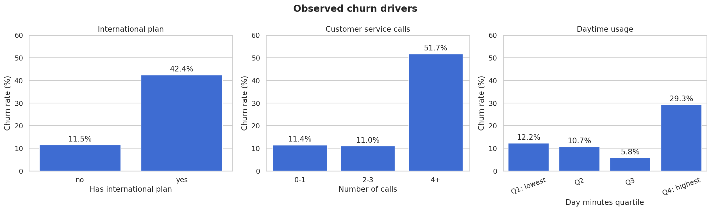
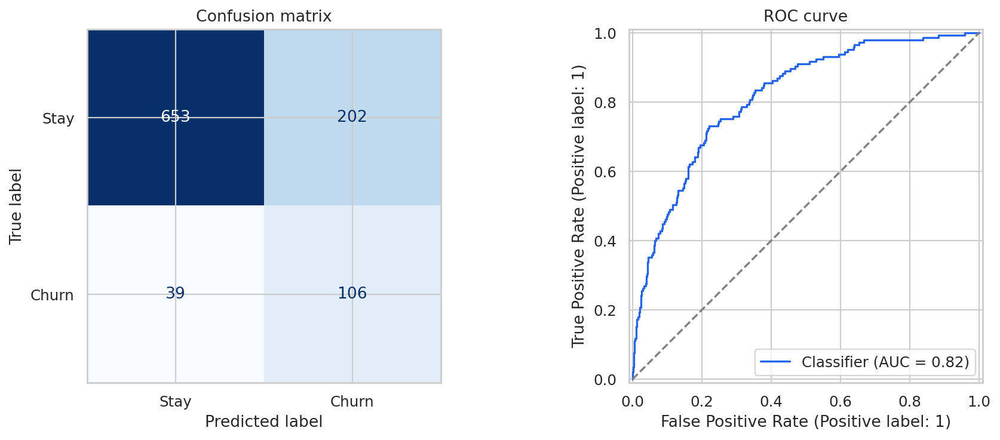

# Customer Churn Analysis and Prediction

An end-to-end customer churn project using exploratory data analysis and interpretable machine learning. The goal is to identify customers at risk of leaving while making the trade-off between recall and precision explicit.



## Business problem

Only 14.5% of customers in the dataset churned. A naive model that predicts that every customer stays reaches 85.5% accuracy but finds no churners. For that reason, this project treats recall, precision, F1, ROC-AUC and PR-AUC as more informative than accuracy alone.

## Key findings

- Customers with an international plan churned at **42.4%**, compared with **11.5%** among customers without one.
- Customers with at least four customer service calls churned at **51.7%**.
- Customers in the highest quartile of daytime usage churned at **29.3%**.

## Model results

The selected model is logistic regression with balanced class weights. On the held-out test set it achieved:

| Metric | Score |
| --- | ---: |
| Accuracy | 0.759 |
| Precision | 0.344 |
| Recall | 0.731 |
| F1 | 0.468 |
| ROC-AUC | 0.817 |
| PR-AUC | 0.459 |

The model detected **106 of 145 churners**. It flagged 308 customers for outreach, including 202 false positives. This is a deliberate trade-off: higher recall is useful when missing a churner is more expensive than contacting a customer who would have stayed.



## Business recommendations

1. Review the pricing and customer experience of the international plan.
2. Escalate unresolved cases after the third customer service contact.
3. Investigate whether high daytime usage is linked to pricing dissatisfaction.
4. Use predicted probabilities and campaign cost data to prioritize retention outreach.

## Project structure

```text
customer-churn-analysis/
├── data/
│   └── README.md
├── notebooks/
│   └── customer_churn_analysis.ipynb
├── reports/
│   └── figures/
├── .gitignore
├── LICENSE
├── README.md
└── requirements.txt
```

## How to run

1. Download the dataset described in `data/README.md` and save it as `data/Telco.csv`.
2. Create a virtual environment and install the dependencies:

```bash
python -m venv .venv
source .venv/bin/activate  # Windows: .venv\Scripts\activate
pip install -r requirements.txt
```

3. Start Jupyter and open the notebook:

```bash
jupyter notebook notebooks/customer_churn_analysis.ipynb
```

## Data source

The supplied file matches the schema of Kaggle's [Churn in Telecom's dataset](https://www.kaggle.com/datasets/becksddf/churn-in-telecoms-dataset). The source currently lists the license as unknown, so the raw CSV is intentionally not redistributed in this repository.

## Limitations

- The dataset does not contain collection dates or detailed source metadata.
- Results show associations rather than causal effects.
- The classification threshold was not optimized against real retention campaign costs.
- The model requires validation on recent operational data before use.

## Author

Kinga Jaszewska
